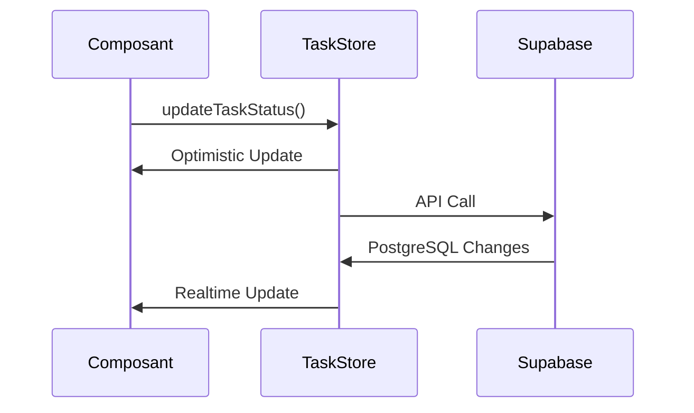

# Architecture Frontend pour la Gestion des Statuts

## 1. Store des Tâches (`src/store/taskStore.ts`)
```typescript
interface TaskState {
  // ... autres propriétés
  updateTaskStatus: (id: string, status: TaskStatus) => Promise<void>;
  initRealtime: () => () => void; // Abonnement aux changements
}
```
Responsabilités :
- Synchronisation bidirectionnelle avec Supabase
- Optimistic updates pour une UI réactive
- Gestion des erreurs et reconnexion

## 2. Composant StatusDropdown (`src/components/Tasks/StatusDropdown.tsx`)
```typescript
interface StatusDropdownProps {
  taskId: string;
  currentStatus: TaskStatus; // 'pending' | 'in_progress' | 'completed' | 'cancelled'
}
```
Fonctionnalités :
- Affichage visuel avec couleurs thématiques
- Menu interactif pour modifier le statut
- Appel au store pour les mises à jour

## 3. Hook d'Abonnement (`src/hooks/useTaskSubscription.ts`)
```typescript
export function useTaskSubscription() {
  const { initRealtime } = useTaskStore();
  // Initialise et nettoie l'abonnement
}
```
Flux :
1. S'abonne aux changements PostgreSQL
2. Dispatch les updates au store
3. Nettoie l'abonnement

## 4. Intégration Principale (`src/App.tsx`)
```typescript
function App() {
  useTaskSubscription(); // Initialisation unique
  // ...
}
```

## Diagramme de Flux


## Tests Recommandés
1. Vérifier la synchronisation multi-onglets
2. Tester en mode hors-ligne
3. Valider les états d'erreur