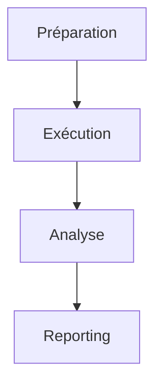

# Plan de Vérification du Fonctionnement

## 1. Tests Fonctionnels
- [ ] CRUD Tâches
- [ ] Workflow Calendrier
- [ ] Transitions de statut

## 2. Tests de Performance
- [ ] Latence API (<300ms)
- [ ] Charge temps réel (50+ concurrents)

## 3. Tests de Sécurité
- [ ] Validation RLS
- [ ] Isolation des données

## 4. Tests d'Intégrité
- [ ] Synchronisation base/front
- [ ] Gestion des conflits

## Méthodologie

## Scripts Associés
- `test_realtime_sync.js`
- `test_task_integrity.ts`