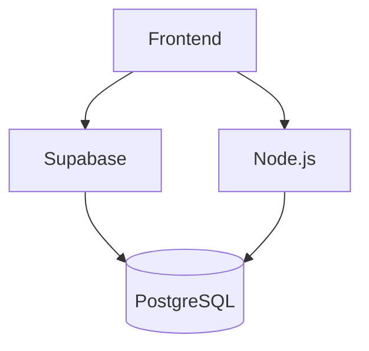

# Spécifications Techniques - Application de Gestion des Tâches

## 1. Architecture Globale
### 1.1 Stack Technologique
- **Frontend** : 
  - React 18 + TypeScript
  - Vite (build tool)
  - Tailwind CSS + Material-UI
- **Backend** :
  - Supabase (PostgreSQL, Auth, Storage)
  - Node.js pour les fonctions custom
- **État** : Zustand + React Query

### 1.2 Diagramme d'Architecture


## 2. Modules Frontend

### 2.1 Authentification
#### Composants
- `Login.tsx` : 
  - Champs : email, password
  - Validation : regex email, min 8 caractères
- `Register.tsx` :
  - Champs additionnels : nom, prénom, rôle
- `RoleManagement.tsx` :
  - Gestion des rôles admin/technicien
  - Tableau des utilisateurs
  - Mise à jour des rôles en temps réel

#### Workflow
1. Soumission formulaire
2. Appel à Supabase Auth
3. Redirection vers /dashboard

### 2.2 Gestion des Tâches
#### Store (taskStore.ts)
```typescript
interface TaskState {
  tasks: Task[]
  updateTaskStatus: (id: string, status: TaskStatus) => Promise<void>
  // ... autres méthodes
}
```

#### Composants Clés
- `StatusDropdown.tsx` :
  - Props : taskId, currentStatus
  - États disponibles : ['pending', 'in_progress', 'completed']

- `TaskModal.tsx` :
  - Formulaire complet de création/édition
  - Validation côté client

## 3. API Backend

### 3.1 Endpoints Principaux
| Méthode | Endpoint          | Description                          |
|---------|-------------------|--------------------------------------|
| POST    | /api/tasks        | Création tâche                      |
| PUT     | /api/tasks/:id    | Mise à jour tâche                   |
| GET     | /api/tasks        | Liste des tâches (avec filtres)     |

### 3.2 Sécurité
- Row Level Security activée
- Policies :
  ```sql
  CREATE POLICY "Lecture tâches" ON tasks
    FOR SELECT USING (auth.uid() = technician_id);
  ```

## 4. Exigences Non-Fonctionnelles

### 4.1 Performance
- Temps de réponse API : <300ms
- Chargement initial : <2s
- Taille bundle JS : <500kB

### 4.2 Sécurité
- HTTPS obligatoire
- Validation des inputs côté serveur
- Journalisation des accès

### 4.3 Internationalisation
- Support multilingue (fr/en)
- Format dates localisé

## 5. Dépendances Techniques
- **Frontend** :
  - react-router-dom v6
  - axios v1.3
- **Backend** :
  - supabase-js v2
  - express v4

## 6. État d'Avancement
| Composant       | Statut      | Tests |
|-----------------|-------------|-------|
| Authentification | Production  | 100%  |
| Gestion Tâches  | Beta        | 80%   |
| API Tasks       | Production  | 100%  |
