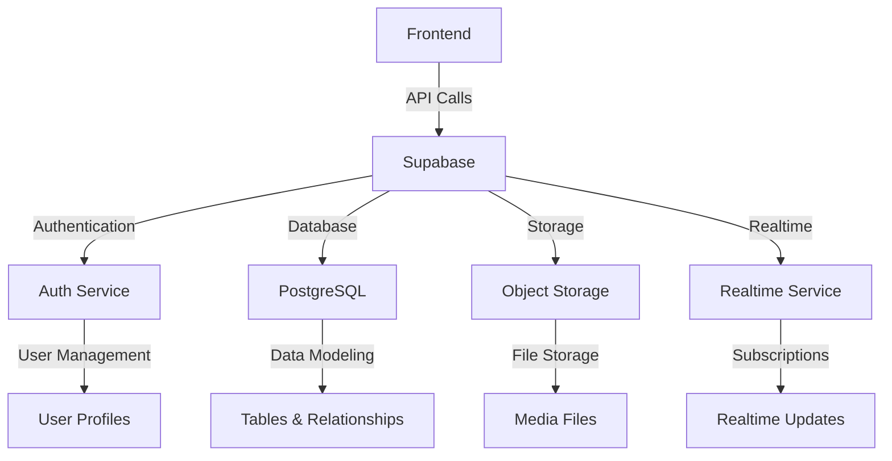

# Supabase Integration Plan

## Architecture Overview

## Implementation Steps

### 1. Initial Setup
- Create Supabase project
- Configure environment variables
- Install Supabase client library

### 2. Authentication
- Implement email/password auth
- Add social login providers
- Configure Row Level Security (RLS)
- Set up user profiles table

### 3. Database Design
- Define core tables and relationships
- Implement proper indexing
- Set up RLS policies
- Create stored procedures for complex queries

### 4. Storage Integration
- Configure bucket policies
- Implement file upload/download
- Set up image transformations

### 5. Realtime Features
- Identify realtime data needs
- Configure subscriptions
- Implement presence tracking

## Security Best Practices
- Enable SSL enforcement
- Configure network restrictions
- Set up two-factor authentication
- Implement rate limiting

## Performance Optimization
- Use database indexes effectively
- Implement caching strategies
- Optimize query performance
- Use connection pooling

## Scalability Considerations
- Plan for database partitioning
- Implement proper sharding
- Set up monitoring and alerts
- Configure auto-scaling